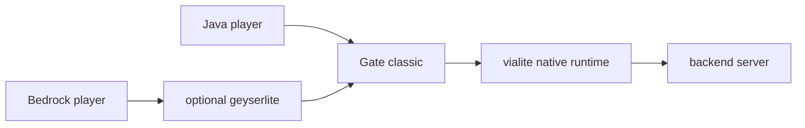

<!-- markdownlint-disable MD041 -->

<div align="center">

# vialite

**Native Via compatibility for Gate backend connections.**
**Embeddable in Go; built for Gate classic edge proxies.**

[](https://pkg.go.dev/go.minekube.com/vialite)
[](https://minekube.com/discord)

</div>

`vialite` packages Via-powered Minecraft protocol translation behind
GraalVM native artifacts and a small Go API. Gate can start the native
runtime as a managed subprocess, or load the shared library in-process.
Gate keeps ownership of frontend auth, events, routing, Connect, and backend
login.

Target topology:



The first supported use case is backend version compatibility. If Gate
accepts the player, `vialite` helps Gate speak to backend servers running
different Java protocol versions. It is not a Gate Lite feature and it is
not the first frontend compatibility layer for clients Gate cannot parse.

## Runtime Modes

- **Embedded:** loads `libvialite` in-process. This is the preferred shape for
  dynamic backend registrations because one warmed Via runtime can add and
  remove translated backend listeners.
- **Subprocess:** starts the native `vialite` binary as a child process. This is
  a portable fallback and remains useful for static backend configs.

## What This Repo Provides

| Component | Status |
| --- | --- |
| Go module `go.minekube.com/vialite` | Lifecycle, readiness, artifact lookup, embedded/subprocess runners, dynamic backend registration, backend dial address API |
| Gate adapter `go.minekube.com/vialite/integration/gate` | Gate-shaped config and fakeable lifecycle wrapper |
| Native build scaffold | ViaProxy soft-fork overlay and isolate-thread-aware C ABI contract |
| Release/update loop | CI, release-please, Renovate, checksummed Linux amd64/arm64 libraries and subprocess binaries, plus Windows amd64 subprocess binary |

When `Options.Version` is empty, `auto`, or `latest`, the Go module checks the
latest stable GitHub release, downloads the matching checksummed artifact into
the local cache, and starts that artifact. Set `Version` to a release tag to
pin an exact version, set `Offline` to disable network access, or
set `BinaryPath`/`LibraryPath` to use a local artifact directly.

## Go Quick Start

```go
srv, err := vialite.New(vialite.Options{
    Mode:         vialite.ModeEmbedded,
    GateProtocol: "auto",
    Backends: []vialite.Backend{
        {
            Name:       "lobby",
            Address:    "127.0.0.1:25566",
            Version:    "auto",
            Forwarding: vialite.ForwardingVelocity,
        },
    },
})
if err != nil {
    return err
}
go func() { _ = srv.Start(ctx) }()
if err := srv.WaitReady(ctx); err != nil {
    return err
}

addr, err := srv.BackendDialAddress("lobby")
if err != nil {
    return err
}
// Gate dials addr instead of the raw backend address.
```

## Local Development

```sh
mise trust && mise install
mise run setup
mise run test
mise run lint
```

The native build path is scaffolded separately:

```sh
mise run overlay:apply
mise run build:native
```

## Repository Layout

```text
vialite/
├── go/                   # Go module: go.minekube.com/vialite
│   └── integration/gate/ # Gate-shaped lifecycle adapter
├── build/                # native-image pipeline + Via overlay
├── docs/                 # architecture, Gate integration, troubleshooting
└── .github/workflows/    # CI, native build, release automation
```

See [docs/architecture.md](docs/architecture.md),
[docs/gate.md](docs/gate.md), and
[docs/dynamic-backends.md](docs/dynamic-backends.md) for the detailed
integration model.
